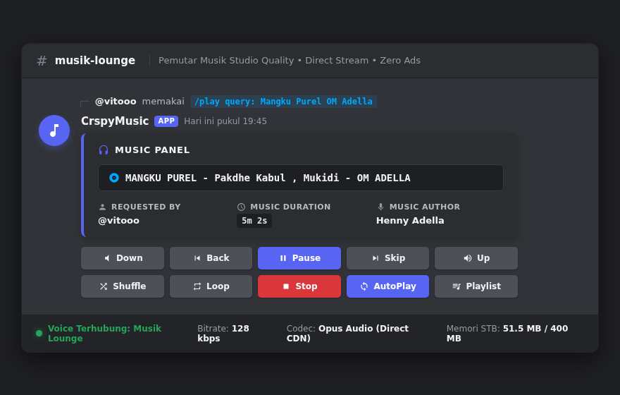
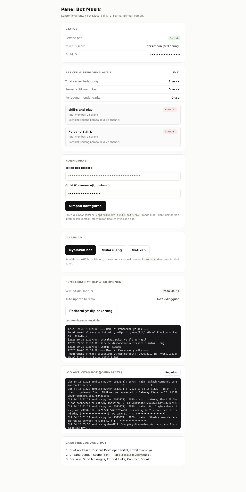
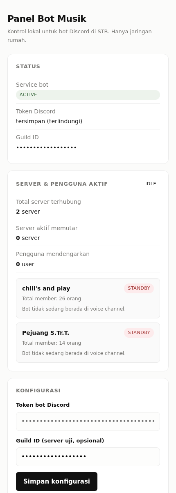

# 🎵 Discord Music Bot (Lightweight, Ad-Free & Studio Quality)

[](https://python.org)
[](https://discordpy.readthedocs.io/)
[](https://github.com/yt-dlp/yt-dlp)
[](https://github.com/chsprs/discord-music-bot)
[](LICENSE)
[](https://armbian.com)
[](#performa--arsitektur)

Bot musik Discord ultra-ringan, hemat sumber daya (<50MB RAM), dan bebas iklan yang dirancang khusus untuk homelab Linux SBC/STB ARM64 (Armbian, Raspberry Pi) maupun VPS x86. Mengalirkan direct audio stream Opus dari YouTube & YouTube Music langsung ke voice socket Discord dengan kualitas audio tinggi, kontrol panel interaktif modern, dan web panel manajemen LAN tanpa ketergantungan framework berat.

---

## 📸 Tampilan Antarmuka

### 🎧 Discord Player (Interactive Music Panel)
Tampilan panel interaktif modern di voice/text channel Discord dengan 10 tombol kontrol realtime, indikator bitrate/codec, dan informasi metadata lagu.



### 🖥️ Web Control Panel Mandiri (Port 9130)
Dashboard web lokal ringan untuk pemantauan runtime, kontrol service, konfigurasi token/server, dan log pembaruan otomatis tanpa perlu akses SSH terminal.

| Desktop Dashboard | Mobile Responsive |
| :---: | :---: |
|  |  |

---

## ✨ Fitur Utama

- **Hemat Memori & CPU:** Konsumsi RAM stabil ~46 MB pada arsitektur STB ARM64 (Amlogic S905X / H96 Max / HG680P) tanpa beban video rendering.
- **Bebas Iklan (Ad-Free):** Memutar direct stream audio dari CDN Google (`googlevideo.com`), bebas dari gangguan pre-roll dan mid-roll iklan.
- **Kualitas Audio Studio (Studio Quality):**
  - Profil enkoder Opus full-band (`-application audio`) dengan kualitas kompresi algoritma maksimal (`-compression_level 10`).
  - Penyesuaian bitrate dinamis otomatis mengikuti kapasitas bitrate voice channel Discord server (hingga 96–128 kbps).
  - Variable Bitrate (`-vbr on`) menjaga dinamika bass, treble, dan vokal tetap jernih tanpa clipping.
- **Pengaturan Volume Realtime:**
  - Slider/step volume via tombol `Down` (-10%) dan `Up` (+10%) hingga 200%.
  - Menggunakan `PCMVolumeTransformer` terintegrasi libopus C-native sehingga volume berubah seketika tanpa jeda pemuatan ulang lagu.
- **Dukungan Playlist & Pencarian Kilat:**
  - Mendukung tautan video tunggal maupun playlist YouTube / YouTube Music (`list=...`).
  - Ekstraksi metadata instan (<2 detik) hingga 100 lagu per playlist.
  - Video private / dihapus otomatis dilewati tanpa menghentikan pemutaran (`ignoreerrors`).
  - Ekstraksi stream secara *lazy* (hanya saat giliran lagu dimulai) agar URL CDN tidak kedaluwarsa dan menghemat bandwidth.
- **Fitur Cerdas (AutoPlay, Loop, Shuffle & History):**
  - **AutoPlay (YouTube Mix):** Saat antrian/playlist habis, bot mengambil rekomendasi langsung dari **YouTube Mix** — algoritma radio resmi YouTube (`watch?v=<id>&list=RD<id>&start_radio=1`) yang di-seed dari lagu yang baru diputar, sehingga hasilnya mengikuti "radio" asli YouTube, bukan sekadar pencarian kata kunci. Bila ekstraksi Mix gagal (video tak tersedia / radio tidak dapat dibuka), bot otomatis **fallback ke pencarian teks** berbasis riwayat lagu sebelumnya. Semua kandidat disaring terhadap lagu yang pernah diputar (**anti-ulang**) agar tidak mengulang lagu yang sama; bila tidak ada kandidat baru, pemutaran berhenti dengan rapi. Jumlah lagu yang ditarik per rekomendasi diatur lewat `MIX_RESULT_LIMIT` (default `15`).
  - **Loop Mode:** Siklus pengulangan 3-arah: *Track* (ulang 1 lagu), *Queue* (ulang seluruh antrian), atau *Off*.
  - **Shuffle:** Mengacak urutan antrian lagu seketika secara acak.
  - **History Backtracking:** Menyimpan riwayat lagu yang baru diputar agar tombol `Back` dapat memutar ulang lagu sebelumnya.
- **AFK Guard (Auto-Disconnect & Hemat Daya):**
  - Bot otomatis mendeteksi saat tidak ada pendengar manusia di dalam voice channel.
  - Memulai timer tunggu (default 3 menit via `AFK_TIMEOUT_SECONDS`), otomatis melanjutkan lagu jika ada user yang masuk kembali, atau mematikan proses FFmpeg dan disconnect voice jika room tetap kosong guna menghemat CPU dan RAM STB.
- **Persistent Queue (Antrean Tahan Restart):**
  - Antrean lagu dan track yang sedang berjalan otomatis dicadangkan ke tmpfs (`/run/discord-music/queue_state.json`).
  - Saat bot di-restart untuk pembaruan mingguan atau server reboot, antrean dipulihkan seketika tanpa kehilangan daftar putar.
- **Web Control Panel Mandiri & Pemantau Server/Pengguna:**
  - Web dashboard di port `9130` (dibangun murni dengan Python standard library HTTP, aman dengan proteksi CSRF token & nonce).
  - Konfigurasi token bot & ID server Discord langsung dari browser tanpa perlu SSH ke server.
  - Monitor status service & tombol kontrol start / restart / stop service dari web.
  - **Pemantau Server & Pengguna Aktif:** Menampilkan daftar server Discord yang dimasuki bot, channel voice yang sedang tersambung, judul lagu & antrean yang sedang berputar, serta jumlah & nama pengguna yang sedang mendengarkan secara realtime.
  - **Tombol Pembaruan Manual:** Perbarui `yt-dlp` seketika lewat tombol web lengkap dengan riwayat log keluaran terminal.
  - **Pemantau Log Realtime:** Kotak log aktivitas bot (`journalctl`) yang dapat disegarkan langsung dari antarmuka web.
- **Auto-Update Berkala & Zero-Warning JS Runtime:**
  - **Systemd Timer Mingguan:** Menjalankan pembaruan otomatis `yt-dlp` setiap Minggu pukul 04:00 WIB agar cipher extractor YouTube selalu mutakhir. Pembaruan memakai `pip install --upgrade` dan menuliskan versi baru kembali ke `requirements.txt`.
  - **Restart Aman Saat Ada Pendengar:** Bila masih ada yang mendengarkan musik, restart bot ditunda agar pemutaran tidak terputus; versi yt-dlp baru otomatis dipakai pada restart berikutnya.
  - **Integrasi JS Engine:** Terhubung ke Node.js runtime untuk menyelesaikan challenge player API YouTube (EJS) tanpa pesan warning deprecation.
- **Cookies Opsional (video age-restricted):** Taruh `cookies.txt` di direktori bot (atau set `YTDLP_COOKIES` di `.env`) untuk memutar video yang butuh login. Berkas dibaca ulang tiap ekstraksi, jadi tidak perlu restart. `cookies.txt` berisi sesi login — sudah masuk `.gitignore`, perlakukan seperti password.
- **Auto-Sync & Auto-Start:**
  - Sinkronisasi slash command otomatis ke seluruh server Discord saat bot dinyalakan atau diundang ke server baru (`on_guild_join`).
  - Service systemd terintegrasi untuk otomatis jalan saat server / STB dinyalakan ulang.

---

## 🎮 Tombol Panel & Slash Commands

### 🎛️ Tombol Kontrol Interaktif (10 Tombol)

| Baris | Tombol | Emoji | Fungsi |
| :--- | :--- | :---: | :--- |
| **Baris 1** | **Down** | 🔉 | Menurunkan volume lagu sebesar -10% |
| | **Back** | ⏮️ | Memutar ulang lagu sebelumnya (riwayat) atau dari awal |
| | **Pause** | ⏸️ | Menjeda atau melanjutkan pemutaran musik |
| | **Skip** | ⏭️ | Melewati lagu yang sedang diputar ke antrian berikutnya |
| | **Up** | 🔊 | Menaikkan volume lagu sebesar +10% (hingga 200%) |
| **Baris 2** | **Shuffle** | 🔀 | Mengacak seluruh urutan lagu di dalam antrian |
| | **Loop** | 🔁 | Mengubah mode perulangan: *Track* ➔ *Queue* ➔ *Off* |
| | **Stop** | ⏹️ | Menghentikan musik, mengosongkan antrian, dan keluar voice |
| | **AutoPlay** | 🔄 | Mengaktifkan/menonaktifkan rekomendasi lagu otomatis (berbasis YouTube Mix) |
| | **Playlist** | 🎵 | Melihat daftar antrian & tombol cepat tambah lagu |

### 💬 Slash Commands Discord

Semua fungsi tombol juga dapat diakses lewat perintah chat slash:

| Perintah | Argumen | Keterangan |
| :--- | :--- | :--- |
| `/musik` | - | Menampilkan panel interaktif musik dan memanggil bot ke voice channel |
| `/play` | `<lagu>` | Memutar lagu atau playlist dari judul atau URL YouTube |
| `/skip` | - | Melewati lagu yang sedang diputar |
| `/back` | - | Memutar lagu sebelumnya dari riwayat |
| `/stop` | - | Menghentikan musik dan mengeluarkan bot dari voice |
| `/quit` | - | Mengeluarkan bot dari voice, mereset antrian, dan membersihkan cache |
| `/antrian` | - | Menampilkan daftar antrian lagu saat ini |
| `/pause` | - | Menjeda atau melanjutkan pemutaran lagu |
| `/volume` | `<0-200>` | Mengatur tingkat volume suara lagu (persentase) |
| `/shuffle` | - | Mengacak urutan antrian lagu |
| `/loop` | `[mode]` | Mengatur mode perulangan (`track`, `queue`, atau `off`) |
| `/autoplay`| - | Mengaktifkan atau menonaktifkan fitur AutoPlay (berbasis YouTube Mix) |
| `/help` | - | Menampilkan daftar perintah dan cara pakai bot |

---

## 🚀 Instalasi Cepat (One-Line Installer)

Jalankan perintah berikut di terminal server Linux (STB Armbian, Debian, Ubuntu, atau VPS):

```bash
git clone https://github.com/chsprs/discord-music-bot.git /opt/discord-music-bot
cd /opt/discord-music-bot
sudo ./install.sh
```

Skrip installer otomatis:
1. Memeriksa dan menginstal paket sistem yang dibutuhkan (`python3`, `python3-venv`, `ffmpeg`, `nodejs`).
2. Menyiapkan Python virtual environment dan menginstal dependensi (`discord.py`, `yt-dlp`).
3. Memasang service systemd `discord-music.service` dan `discord-music-panel.service`.
4. Mengaktifkan auto-start saat boot sistem.
5. Menjalankan verifikasi unit test mandiri (**205/205 passing**).
6. Menyalakan Web Control Panel di port `9130`.

---

## 🛠️ Langkah Penggunaan & Konfigurasi

1. Buka browser pada perangkat di jaringan LAN yang sama:
   ```
   http://<IP_SERVER_STB>:9130
   ```
2. Masukkan **Bot Token** dan **Guild ID** (Server ID Discord).
3. Klik **Simpan konfigurasi**, lalu klik **Nyalakan bot**.
4. Masuk ke Voice Channel di Discord, lalu ketik `/musik` atau `/play <judul/url>`.

> [!WARNING]
> **Keamanan panel.** Panel ini mengendalikan `systemctl` dan `yt-dlp` sebagai root.
> Password awal dibuat otomatis oleh `install.sh` dan disimpan di
> `/opt/discord-music-panel.env`.
>
> - **Jangan** biarkan `PANEL_PASSWORD` kosong bila port `9130` bisa dijangkau
>   perangkat lain. Tanpa password, panel sepenuhnya terbuka.
> - Untuk LAN tak-terpercaya, set `PANEL_HOST=127.0.0.1` di
>   `/opt/discord-music-panel.env` dan akses lewat SSH tunnel
>   (`ssh -L 9130:127.0.0.1:9130 user@host`).
> - `PANEL_ALLOWED_HOSTS` membatasi `Host` header yang diterima (proteksi
>   DNS-rebinding). `install.sh` mengisinya otomatis dengan `IP_LAN:PORT`.
>   Bila dikosongkan, panel mendeteksi sendiri alamat lokal mesin.
> - Panel memakai HTTP polos (tanpa TLS). Jangan ekspos ke internet.

---

## ⚙️ Variabel Lingkungan (`.env`)

Semua variabel opsional kecuali `DISCORD_TOKEN`. Lihat `.env.example` untuk templatnya.

| Variabel | Default | Keterangan |
| :--- | :---: | :--- |
| `DISCORD_TOKEN` | — | **Wajib.** Token bot dari Discord Developer Portal. |
| `DISCORD_GUILD_ID` | — | Opsional. Server uji untuk pendaftaran slash command cepat. |
| `DEFAULT_VOLUME` | `0.5` | Volume suara bawaan bot (0.0–2.0). |
| `YTDLP_COOKIES` | `./cookies.txt` | Lokasi `cookies.txt` untuk video age-restricted / butuh login. |
| `MIX_RESULT_LIMIT` | `15` | Jumlah lagu yang diambil dari YouTube Mix tiap rekomendasi AutoPlay (1–50). Makin besar makin banyak pilihan, tapi ekstraksi makin lambat. |

---

## ⚙️ Pengaturan di Discord Developer Portal

Saat membuat aplikasi bot di [Discord Developer Portal](https://discord.com/developers/applications):

1. **OAuth2 ➔ Default Authorization Link / Installation:**
   - **Installation Contexts**: Centang **Guild Install**.
   - **Scopes**: Centang `bot` dan `applications.commands`.
   - **Permissions**: Centang:
     - `View Channels`
     - `Send Messages`
     - `Embed Links`
     - `Attach Files`
     - `Read Message History`
     - `Connect`
     - `Speak`
2. **Bot ➔ Privileged Gateway Intents:**
   - Bot ini **TIDAK** membutuhkan *Message Content Intent* karena 100% menggunakan Slash Commands dan Button Interaction yang lebih aman dan efisien.
3. **Format Link Undangan Bot:**
   ```
   https://discord.com/oauth2/authorize?client_id=<YOUR_CLIENT_ID>&scope=bot+applications.commands&permissions=2150714368
   ```

---

## 📁 Struktur Berkas

```
/opt/discord-music-bot/
├── bot.py                        # Core bot Discord (audio pipeline, queue, commands, UI View)
├── panel.py                      # Web Control Panel LAN mandiri (stdlib HTTP, CSRF-safe, log viewer)
├── update.sh                     # Skrip pembaruan otomatis yt-dlp & restart bot
├── requirements.txt              # Dependensi Python pip (discord.py, yt-dlp)
├── install.sh                    # Skrip instalasi otomatis satu baris
├── discord-music.service         # Service systemd bot musik
├── discord-music-panel.service   # Service systemd web dashboard
├── discord-music-update.service  # Service oneshot pembaruan yt-dlp
├── discord-music-update.timer    # Timer mingguan auto-update
├── .env.example                  # Templat variabel lingkungan
├── .gitignore
├── README.md                     # Dokumentasi proyek
├── assets/
│   └── screenshots/              # Cuplikan antarmuka Discord UI & Web Control Panel
└── tests/
    ├── test_bot.py               # Unit test core bot, UI View, queue, AFK guard, persistent queue
    ├── test_panel.py             # Unit test web panel, update endpoint, CSRF, validasi DoS & input
    ├── test_update.py            # Unit test skrip update.sh & timer behaviour
    └── test_systemd_units.py     # Unit test validasi hardening unit systemd
```

---

## 🧪 Pengujian Mandiri (Self-Contained Tests)

Jalankan rangkaian unit test lengkap:

```bash
cd /opt/discord-music-bot
PYTHONPATH="" PYTHONHOME="" ./venv/bin/python -m unittest discover -s tests -v
```

Hasil uji:
```
Ran 237 tests in 60.2s
OK
```

---

## 📊 Manajemen Service Linux

```bash
# Cek status bot & web panel
sudo systemctl status discord-music.service
sudo systemctl status discord-music-panel.service

# Melihat status timer auto-update mingguan
sudo systemctl status discord-music-update.timer
sudo systemctl list-timers | grep discord

# Melihat log bot secara realtime
sudo journalctl -u discord-music.service -f

# Menjalankan pembaruan yt-dlp manual via terminal
sudo /opt/discord-music-bot/update.sh
```

---

## 📄 Lisensi

Didistribusikan di bawah **MIT License**. Dirancang dengan fokus pada efisiensi daya, nol beban disk, dan stabilitas jangka panjang untuk lingkungan homelab STB Armbian maupun server produksi.
